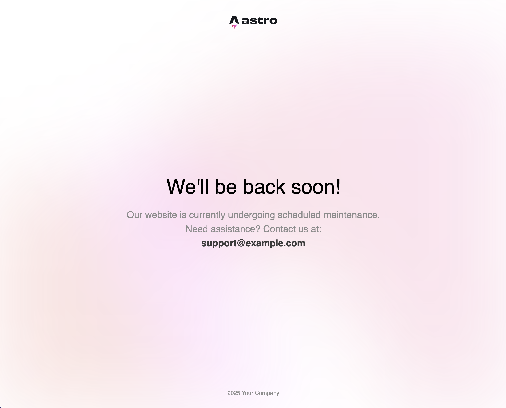
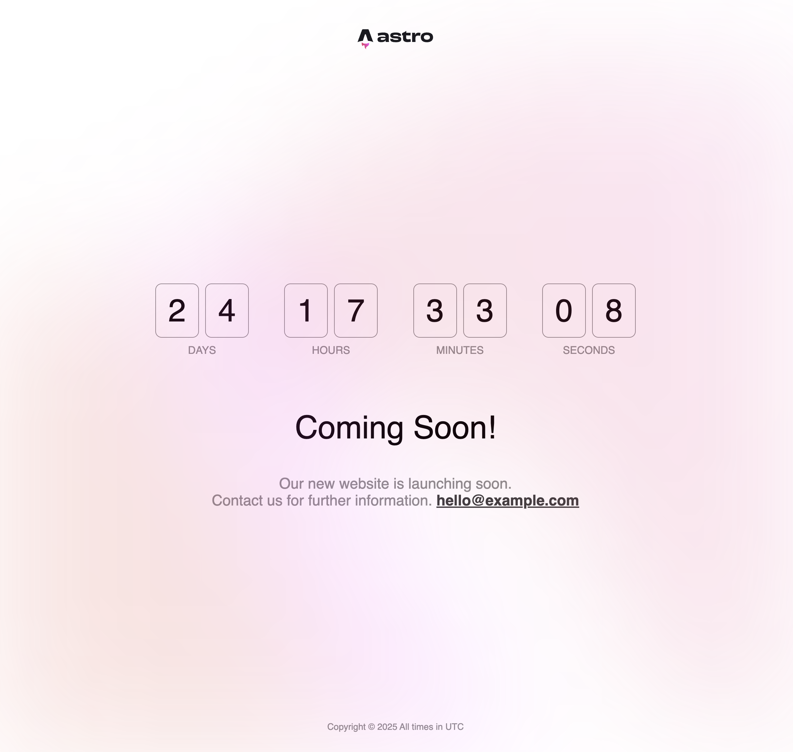
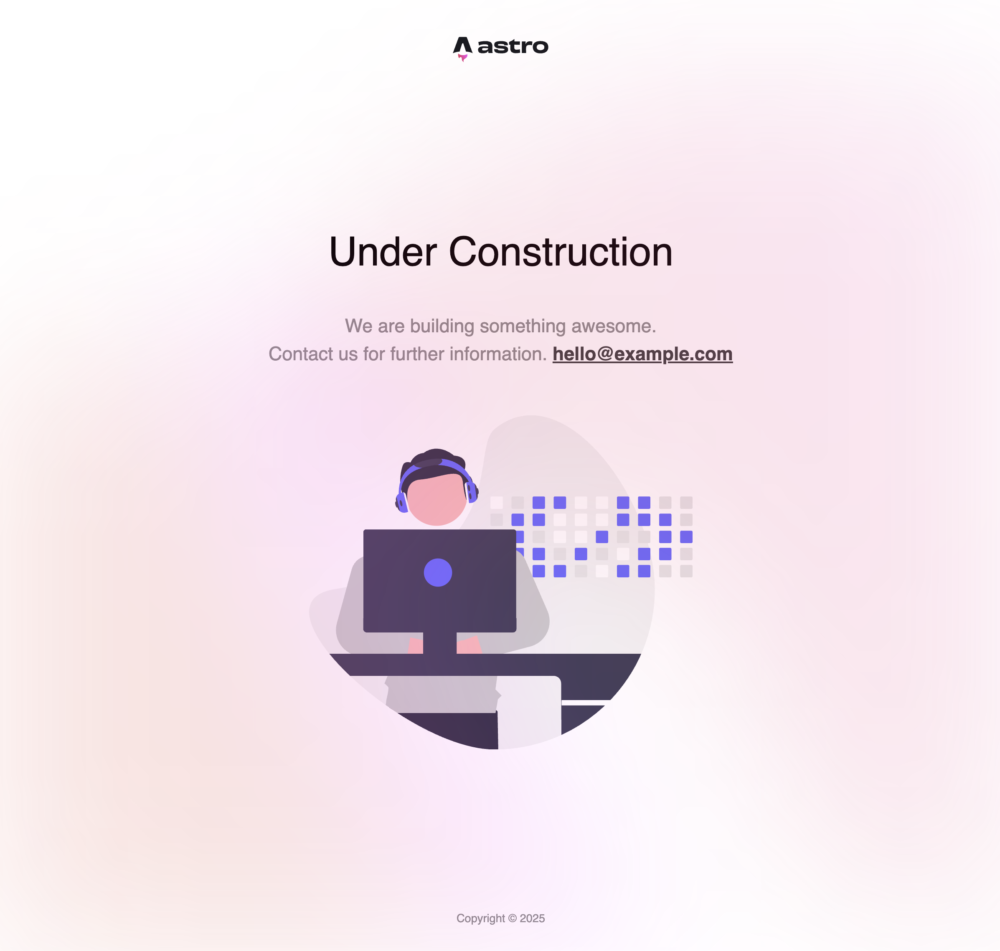

# Astro-Maintenance


The main purpose of the integration is to provide a **simple way** to add **maintenance** and **coming soon** pages to Astro projects during development or scheduled maintenance periods. It should be easy to use and highly customizable.

### Features

- Predefined templates (simple, countdown, construction)
- Support for custom Handlebars templates
- Internal route redirection to custom pages in your Astro site
- Customizable appearance with logo, text, and contact information
- Time-based maintenance with automatic countdown (UTC timezone)
- Automatic disabling of maintenance mode when countdown ends
- Auto-reload functionality that checks every 10 seconds after countdown ends
- Override query parameter to bypass the maintenance page and inspect the site

## Installation

```bash
# npm
npm install astro-maintenance

# yarn
yarn add astro-maintenance

# pnpm
pnpm add astro-maintenance
```

## Usage

Add the integration to your Astro configuration file:

```js
// astro.config.mjs
import { defineConfig } from "astro/config";
import { maintenance } from "astro-maintenance";

export default defineConfig({
  integrations: [
    maintenance({
      enabled: true, // Set to false to disable maintenance mode
      template: "simple", // Options: 'simple', 'countdown', 'construction' or path to custom template
      title: "Site Under Maintenance",
      description:
        "We are performing scheduled maintenance. Please check back soon.",
      // Other optional parameters...
    }),
  ],
});
```

## Configuration Options

The integration accepts the following configuration options:

| Property       | Type                                                  | Description                                                                                  | Required |
| -------------- | ----------------------------------------------------- | -------------------------------------------------------------------------------------------- | -------- |
| `enabled`      | `boolean`                                             | Enable or disable maintenance mode                                                           | Yes      |
| `template`     | `'simple' \| 'countdown' \| 'construction' \| string` | Built-in template, path to custom template, or route path                                    | -        |
| `title`        | `string`                                              | Page title (default: `'Site under maintenance'`)                                             | -        |
| `description`  | `string`                                              | Description text                                                                             | -        |
| `logo`         | `string`                                              | URL to your logo image. Must reside in the `assets` or `logo` subfolder of the public folder | -        |
| `emailAddress` | `string`                                              | Contact email address                                                                        | -        |
| `emailText`    | `string`                                              | Text to display before the email address (default: `'Contact us:'`)                          | -        |
| `copyright`    | `string`                                              | Copyright text                                                                               | -        |
| `countdown`    | `string`                                              | ISO date string for countdown timer in UTC (e.g., `'2025-12-31T23:59:59'`)                   | -        |
| `override`     | `string`                                              | Query parameter to bypass maintenance mode (e.g., `'preview'`)                               | -        |

## Examples

### Basic Maintenance Page

```js
maintenance({
  enabled: true,
  template: "simple",
  title: "We'll be back soon!",
  description: "Our website is currently undergoing scheduled maintenance.",
  emailAddress: "support@example.com",
  emailText: "Need assistance? Contact us at:",
  copyright: " 2025 Your Company",
  override: "preview", // Access your site with ?preview in the URL
});
```

##### Preview - Basic Maintenance Page



### Countdown Timer

```js
maintenance({
  enabled: true,
  template: "countdown",
  title: "Coming Soon!",
  description: "Our new website is launching soon.",
  logo: "/logo.png",
  countdown: "2025-06-01T12:00:00Z", // Launch date in UTC (note the 'Z' for UTC timezone)
  emailAddress: "hello@example.com",
});
```

**Note**: The countdown displays time in UTC. When the countdown reaches zero, the maintenance page will:

1. Automatically disable itself - visitors will see your actual site
2. If there's a time mismatch, the page will attempt to reload every 10 seconds until maintenance mode is disabled

##### Preview - Countdown Timer



### Under Construction

```js
maintenance({
  enabled: true,
  template: "construction",
  title: "Under Construction",
  description: "We are building something awesome.",
  emailAddress: "hello@example.com",
});
```

##### Preview - Under Construction



### Internal Route Redirection

You can redirect users to a custom page in your Astro project by setting the template to a route path that starts with `/`:

```js
maintenance({
  enabled: true,
  template: "/custom-maintenance", // Redirects to this route in your Astro site
  override: "preview",
});
```

This performs a 302 redirect to the specified route when maintenance mode is enabled. You'll need to create this page in your Astro project at the specified route. This is useful when you want to use a fully-featured Astro page with components and styling for your maintenance page.

### Custom Template

You can use a custom Handlebars template by providing a path to the template file:

```js
maintenance({
  enabled: true,
  template: "./templates/custom-maintenance.hbs", // Path relative to the project root
  title: "Custom Maintenance Page",
  description: "Our site is getting an upgrade.",
  // ... other options will be passed to the template
});
```

Here's an example of a custom Handlebars template:

```handlebars
<html lang="en">
  <head>
    <meta charset="UTF-8" />
    <meta name="viewport" content="width=device-width, initial-scale=1.0" />
    <title>{{title}}</title>
  </head>
  <body>
    <div class="your-container">
      {{#if logo}}{{/if}}
      <h1>{{title}}</h1>
      <div class="description">{{description}}</div>

      {{#if emailAddress}}
        <div class="contact">
          {{emailText}}
          <a href="mailto:{{emailAddress}}">{{emailAddress}}</a>
        </div>
      {{/if}}

      {{#if copyright}}
        <footer>{{copyright}}</footer>
      {{/if}}
    </div>
  </body>
</html>
```

## Development Setup

If you want to contribute to this project:

1. Clone the repository
2. Install dependencies: `pnpm install`
3. Build the package: `pnpm build`

## License

MIT
